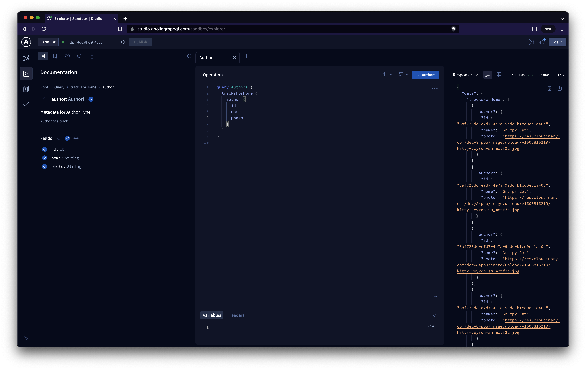

# Understanding Apollo

## From:

> Welcome to the companion app of Odyssey Lift-off I! You can [find the course lessons and instructions on Odyssey](https://odyssey.apollographql.com/lift-off-part1), Apollo's learning platform.
>
> You can [preview the completed demo app here](https://lift-off-client-demo.netlify.app/).

## Test the App

This demo fullstack app contains a server and client folders:

-   Run `npm install` on both if you haven't done it before

-   [server](./server/): Backend GraphQL server.
    -   Run with `npm start`
-   [client](./client/): Frontend UI.

    -   Run with `npm start`
    -   Check for `localhost:3000` in your browser

-   Now the fullstack app is running

## Notes

### Defining the schema

-   Understand the structure you'll need based in your actual development, for this projec we'll need
    -   Title
    -   Thumbnail image
    -   Length (estimated duration)
    -   Module count
    -   Author name
    -   Author picture
-   The graph
    -   This is the collection of objects and relationships between them
    -   Each object is a node and the relationship is an edge
    -   Our entire data is a graph of nodes and edges, which is called our application graph
-   Schema

    -   Defines what a GraphQL API can and can't do
    -   Is written in Schema Definition Language (SDL):

        ```graphql
        """
        Multiline comment with graph's description
        type -> Reserved word
        SomeName -> Graphs name in PascalCase
        Wrapped in curly braces
        """
        type SomeName {
            "Specific comments dataInCamelCase: type"
            coffeCups: Int
            "Values that cannot be nullish need !"
            drinker: String!
            "You can add objects as types"
            orders: [Order]
        }
        ```

    -   It's important to also define the `type Query` that allows us to define the entry points of our schema

        ```graphql
        """
        The query type is added here
        """
        type Query {
            "We just care about having non null TypeOne"
            myTypes = [TypeOne!]!
        }
        """
        Your types are defined here
        """
        type TypeOne {
            name: String!
            typesTwo: [TypeTwo]
        }
        """
        You can define several types
        """
        type TypeTwo {
            name: String!
        }
        ```

    -   You can use it inside JavaScript with template literals

        ```JavaScript
        const typeDefs = `
            """
            Description
            """
            type SomeName {
                coffeCups: Int
                drinker: String!
                orders: [Order]
            }
        `;
        ```

### Backend implementation

#### [V3 Reference](https://www.apollographql.com/docs/apollo-server/v3/)

-   Install Apollo and GraphQL inside your server directory:
    ```Bash
    npm install apollo-server graphql
    ```
-   Create the `schema.js` file in the same location as `index.js`

    -   The structure of the file will be the following one

        ```JavaScript
        const { gql } = require('apollo-server');

        // Types definition
        const typeDefs = gql`
            """
            The query type is added here
            """
            type Query {
                "We just care about having non null TypeOne"
                myTypes = [TypeOne!]!
            }
            """
            Your types are defined here
            """
            type TypeOne {
                name: String!
                typesTwo: [TypeTwo]
            }
            """
            You can define several types
            """
            type TypeTwo {
                name: String!
            }
        `;

        // Export your query so you can be able to use it later
        module.exports = typeDefs;
        ```

-   With the schema defined we can now set our server

    ```JavaScript
    // Dependencies needed to mount the server
    const { ApolloServer } = require('apollo-server');
    const typeDefs = require('./schema');

    // Mocks true is used when data is not yet retreived
    const server = new ApolloServer({ typeDefs, mocks: true });

    // Listen to server
    server.listen().then(() => {
        const port = 4000;
        console.log(`
            Server is running at port ${port}
            http://localhost:${port}
        `);
    });
    ```

    -   You can always define your mock data using JavaScript objects that have function as values

        ```JavaScript
        const mocks = {
            // Define your mock properties here
            MyType: () => ({id: () => 'myID', title: () => 'myTitle'})
        }
        ```

        -   You can use this variable instead the `mocks: true` entry inside your `ApolloServer`

    -   When everything is set you can now go to `http://localhost:4000` press the `Query your server` button (if it's not automatic) and play with your queries using the **Apollo Explorer Interface**
        
        -   In the documentation panel you'll see your types defined in the schema
            -   This panel has several useful functions, like adding types by clicking them, checking the type structure, adding just scalar or object types, etc
            -   You can also save your queries for future inquiries
        -   In the middle of the screen there will be a query editor where you can write your queries
            -   When your query is ready just press the run button at the right-top corner of the editor
        -   The last panel at the right will display your query results

### Frontend implementation

## Apollo Help

-   [Odyssey topic in our community forums](https://community.apollographql.com/tags/c/help/6/odyssey).
